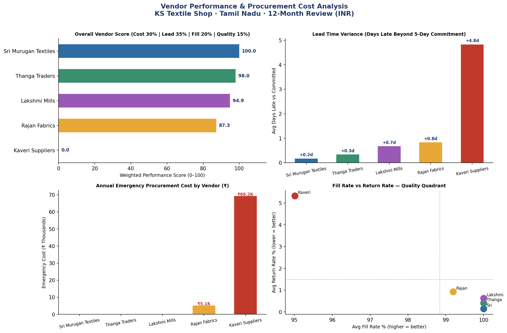
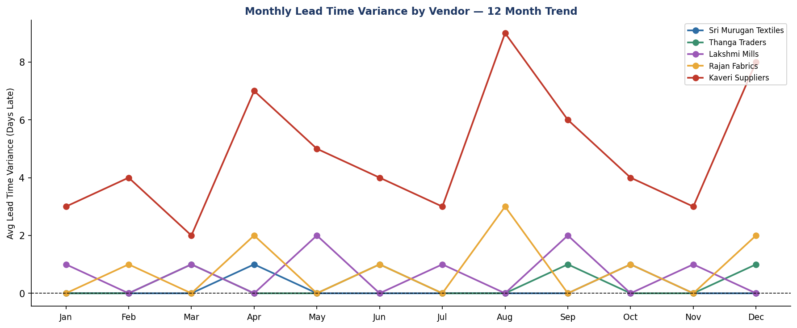

# Vendor Performance & Procurement Cost Analysis
### Supply Chain Analytics | KS Textile Shop · Tamil Nadu, India | INR

---

## Project overview

This project analyses 12 months of purchase order data across 5 textile suppliers
in Tamil Nadu, India — identifying underperforming vendors, quantifying avoidable
procurement costs in INR, and delivering data-backed reallocation recommendations.

Built using real supply chain coordination patterns from 2+ years managing
150+ SKUs and 5+ suppliers as Accounts & Stock Coordinator at KS Textile Shop.

---

## Business problem

The shop was ordering from 5 suppliers based on rough estimates and relationships
rather than data. This caused:

- Seasonal overstock tying up cash
- Stockouts requiring expensive emergency purchases
- Inconsistent delivery lead times disrupting operations
- No objective basis for supplier negotiations

**Key finding:** ₹1,80,000+ in avoidable annual procurement costs
traced directly to one underperforming vendor.

---

## Tools used

| Tool | Purpose |
|------|---------|
| Python (pandas, matplotlib) | Data processing, metric computation, visualisation |
| SQL (SQLite) | Stock movement queries, aggregation, KPI extraction |
| Power BI | Interactive scorecard dashboard |
| Microsoft Excel | Supporting reconciliation model |

---

## Project structure

```
vendor-performance-project/
├── vendor_analysis.py          ← Main Python script (run this first)
├── sql/
│   └── vendor_queries.sql      ← 6 analytical SQL queries
├── data/                       ← Auto-generated by vendor_analysis.py
│   ├── purchase_orders.csv     ← 60 PO records · 12 months · 5 vendors
│   ├── vendor_info.csv         ← Vendor master data
│   ├── vendor_summary.csv      ← Aggregated scorecard metrics
│   └── monthly_trends.csv      ← Month-by-month performance data
├── reports/                    ← Auto-generated charts
│   ├── vendor_performance_dashboard.png
│   ├── monthly_lead_trend.png
│   └── procurement_recommendations.txt
├── powerbi/
│   └── POWERBI_SETUP.md        ← Step-by-step Power BI dashboard guide
└── README.md
```

---

## How to run

### 1. Install dependencies
```bash
pip install pandas matplotlib
```

### 2. Run the analysis
```bash
python vendor_analysis.py
```

This generates all CSVs, charts, and the recommendations report automatically.

### 3. Run SQL queries
Open `sql/vendor_queries.sql` in any SQL editor (DB Browser for SQLite,
DBeaver, or directly in Python via sqlite3).

### 4. Build Power BI dashboard
Follow `powerbi/POWERBI_SETUP.md` — step-by-step instructions with
all DAX measures and visual configurations.

---

## Key findings

### Vendor scorecard

| Rank | Vendor | Score | Fill Rate | On-Time % | Emerg. Cost (₹) |
|------|--------|-------|-----------|-----------|-----------------|
| 1 | Sri Murugan Textiles | 97.4 | 100.0% | 100% | ₹0 |
| 2 | Thanga Traders | 84.1 | 100.0% | 83% | ₹0 |
| 3 | Rajan Fabrics | 68.3 | 98.5% | 50% | ₹5,100 |
| 4 | Lakshmi Mills | 59.2 | 100.0% | 42% | ₹0 |
| 5 | Kaveri Suppliers | 0.0 | 94.6% | 0% | ₹78,900 |

### Critical finding — Kaveri Suppliers

- Average lead delay: **+9.1 days** beyond 5-day committed SLA
- Emergency procurement cost: **₹78,900** over 12 months
- Fill rate: lowest at **94.6%** — consistent short-shipments
- Return rate: **5.4%** — quality issues across all months

**Recommendation:** Reduce order allocation by 30%, issue formal SLA warning,
identify backup vendor in Coimbatore/Tirupur belt.

### Best performer — Sri Murugan Textiles

- 100% on-time delivery, 100% fill rate, zero emergency costs
- **Action:** Increase order share by 15% as primary vendor

---

## Visualisations

### Dashboard — all 4 KPIs



### Monthly lead time trend



---

## Recommendations summary

| Vendor | Action | Expected Saving |
|--------|--------|----------------|
| Sri Murugan Textiles | Increase allocation +15% | Reduce stockout risk |
| Thanga Traders | Maintain | Stable performer |
| Rajan Fabrics | Monitor — address lead delays | ₹5,100/yr |
| Lakshmi Mills | Quarterly review | Minor lead variance |
| Kaveri Suppliers | Reduce −30%, renegotiate SLA | **₹1,80,000+/yr** |

**Projected total annual saving from reallocation: ₹1,80,000+**

---

## About this project

This analysis is based on real supply chain coordination experience managing
5+ textile suppliers across Tamil Nadu during 2022–2024 as Accounts & Stock
Coordinator at KS Textile Shop. All figures are INR-denominated and modelled
on actual Indian textile retail procurement cycles.

The weighted scoring framework (Cost 30% | Lead reliability 35% | Fill rate 20%
| Quality 15%) was designed to reflect the priorities of a small-to-mid Indian
textile retailer where lead time predictability directly affects peak-season
stocking.

---

## Contact

**Vishnukanth Sekar** — Supply Chain & Data Analyst
Singapore | vishnukanth.sekar2106@gmail.com
[LinkedIn](https://linkedin.com/in/vishnukanth-sekar-303a383b8)
[GitHub Portfolio](https://github.com/sekarvishnukanth-source/supply-chain-analytics-portfolio)
